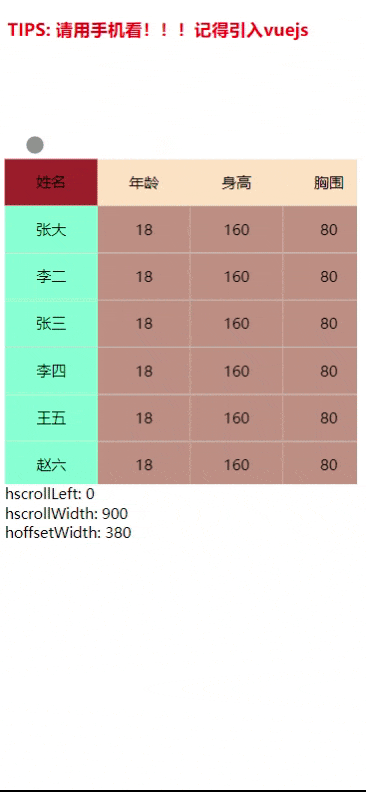

## 滚动表格，固定表头和第一栏

- 初衷：需求是做一个股票类的自选列表的h5，需要固定表头，和第一栏，还需要在每一行长按的时候唤出菜单，删除或者置顶某一项。

- 在找了一圈框架后选择了vxe-table，可以固定表头和第一栏，但是有两个问题
  1. 纵向滚动的时候，如果用户滚动快会产生便宜，因为用户纵向滚动的操作最为频繁，比较影响
  2. 表格为组件生成，无法单独对某一行动态添加元素，更为致命的是这是一个给pc用的框架，不支持长按。
  
- 找了很多市面上的类似实现方法，大多用两个表格来实现，同样会出现vxe-table第一个纵向滚动不同步的情况。

-
-
-
- 过了很久，终于悟出来了，可以不让纵向滚动产生偏移的方法 
-
-
-

### 纵向滚动解决
1. 干脆把纵向的固定部分包在纵向滚动内容里
2. 然后固定部分相对于滚动内容外面的滚动盒子定位
3. 第一个+第二个就可以保证同步滚动
4. 固定部分设置z-index 高于滚动内容的z-index, 保证固定部分盖住滚动内容的第一列

### 横向滚动解决
1. 横向滚动部分在纵向滚动部分里面包裹着
2. 正常写法，注意横向滚动盒子的宽度是和整个table宽度一致的

### 表头
1. 把上述的部分拷一份出来，只留第一行，就可以作为表头了
2. 表头放在上述的纵向滚动部分上方，组成一个表格，但其实是一上一下两个表格

### 联动
1. 监听表头的滚动事件，给表体设置横向滚动位置
2. 监听表体的滚动事件，给表头设置横向滚动位置

> 总结：该方案纵向滚动不会出现错位，横向滚动因为用户操作少，且横向不会很长，横向大概率(保守一点)不会出现偏移

### 效果图

